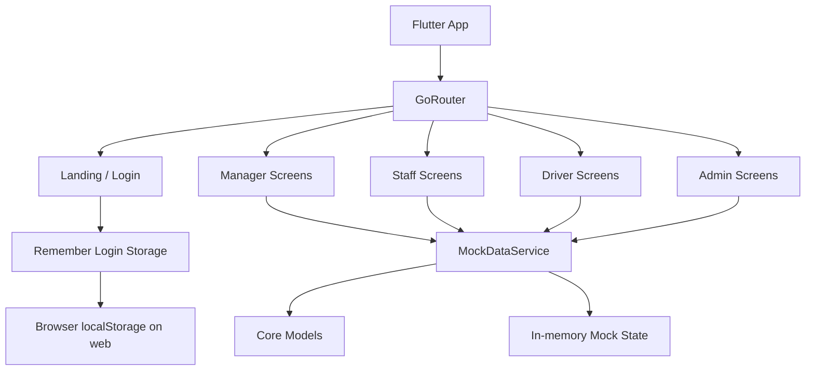

# ParkSmart SWP08


> Smart parking building management prototype built with Flutter for the SU26SWP08 project.

## Overview

**ParkSmart SWP08** is a role-based parking building management system prototype designed for four user groups:

- `Manager`
- `Staff`
- `Driver`
- `Admin`

The project focuses on parking operations, slot visibility, check-in/check-out flows, pre-booking, exception handling, pricing, reporting, and system configuration in a single Flutter codebase.

This repository currently contains a **frontend-first prototype**:

- The main application is a Flutter app in `lib/`
- Business logic is handled by an in-memory `MockDataService`
- No real backend API or database is connected yet
- Mock data resets when the app reloads
- On web, the app opens on a customer-facing landing page at `/`
- On desktop/mobile, the app opens directly on the login screen

## Key Features

### Manager Features

- Dashboard with occupancy, revenue, floor utilization, and live session summaries
- Parking zone and slot management by floor
- Flexible-zone AI suggestion dialog for parking layout optimization
- Pricing policy management by vehicle type
- Reports for traffic, revenue, and exception summaries
- Advanced exception management for lost tickets, wrong plates, overtime, unpaid sessions, and wrong-zone parking

### Staff Features

- Vehicle check-in with mock plate scanning
- Automatic slot assignment by floor and vehicle type
- QR code generation for parking sessions
- Vehicle check-out with fee calculation
- Active session lookup by license plate
- Exception resolution workflow for abnormal cases

### Driver Features

- Real-time parking availability overview
- View active and historical parking sessions
- Pre-book parking by vehicle type, floor, and time window
- Receive booking confirmation codes and assigned slot info
- Submit feedback and issue reports

### Admin Features

- Update building name, address, and operating hours
- View floor and slot configuration summaries
- Manage users with role filters, search, pagination, create/edit/delete flows

### Shared UX Features

- Responsive shell with sidebar on desktop and bottom navigation on mobile
- Customer landing page inside the Flutter web app
- Separate static landing page under `landing/`
- Mock CAPTCHA for registration
- Remembered username on web via browser local storage

## Demo Accounts

> In the current prototype, **any password works** as long as the username exists and the account is active.

| Role | Username(s) | Default Route |
| --- | --- | --- |
| Manager | `manager` | `/manager` |
| Staff | `staff1`, `staff2` | `/staff` |
| Driver | `driver1`, `driver2` | `/driver` |
| Admin | `admin` | `/admin` |

## Technologies Used

| Category | Technology |
| --- | --- |
| Framework | Flutter |
| Language | Dart |
| Routing | `go_router` |
| State Management | `provider` with `ChangeNotifier` |
| Charts | `fl_chart` |
| Fonts | `google_fonts` |
| Animation | `flutter_animate` |
| QR Generation | `qr_flutter` |
| Formatting / Locale | `intl` |
| ID Generation | `uuid` |
| Static Landing Assets | HTML, CSS, SVG |

## Architecture

The current app follows a simple layered prototype architecture:



### Architecture Notes

- `lib/main.dart` bootstraps the app and injects `MockDataService` globally with `Provider`
- `lib/core/router/app_router.dart` handles redirects and role-based navigation
- `lib/features/` contains screen modules grouped by actor/role
- `lib/shared/widgets/responsive_shell.dart` switches between desktop and mobile navigation patterns
- `lib/core/services/mock_data_service.dart` acts as the current data/service layer
- `lib/core/models/` defines the domain entities used across the app

## Project Structure

```text
parking_management/
├── lib/
│   ├── core/
│   │   ├── models/
│   │   ├── router/
│   │   ├── services/
│   │   └── theme/
│   ├── features/
│   │   ├── admin/
│   │   ├── auth/
│   │   ├── driver/
│   │   ├── landing/
│   │   ├── manager/
│   │   └── staff/
│   ├── shared/
│   │   ├── utils/
│   │   └── widgets/
│   └── main.dart
├── landing/                  # Separate static marketing landing page
├── web/                      # Flutter web host files/icons
├── docs/
│   └── AI_USAGE_LOG.md
├── test/
├── pubspec.yaml
└── README.md
```

## APIs and Databases

### Current State

- No external API is connected
- No real database is connected
- All operational data is generated and stored in `MockDataService`
- Web-only remembered login uses browser `localStorage`

### What Is Mocked Right Now

- Users
- Floors and slots
- Parking sessions
- Pricing policies
- Pre-bookings
- Feedback reports
- Exception cases

### Backend Integration Readiness

The UI and domain structure are already separated well enough to replace `MockDataService` later with:

- REST APIs
- Repository classes
- Persistent databases such as PostgreSQL, MySQL, or MongoDB

## Installation

### Prerequisites

- Flutter SDK `>=3.0.0`
- Dart SDK `>=3.0.0`
- A configured Flutter target such as Chrome, Windows, macOS, Linux, or Android

### Setup

```bash
git clone https://github.com/TranGiaBao2005/Parking-Building-Management-System.git
cd Parking-Building-Management-System
flutter pub get
```

## How to Run

### Run the Flutter App on Web

```bash
flutter run -d chrome
```

### Run the Flutter App on Windows

```bash
flutter run -d windows
```

### Run the Flutter App on macOS

```bash
flutter run -d macos
```

### Run the Flutter App on Linux

```bash
flutter run -d linux
```

### Build for Web

```bash
flutter build web
```

### Run Tests

```bash
flutter test
```

### Analyze the Project

```bash
flutter analyze
```

### View the Separate Static Landing Page

Open the file below directly in a browser, or serve the `landing/` folder with a static server:

```text
landing/index.html
```

## Screenshots

No project screenshots are committed yet. Suggested placeholders:

| Screen | Placeholder |
| --- | --- |
| Web Landing Page | `docs/screenshots/landing-page.png` |
| Manager Dashboard | `docs/screenshots/manager-dashboard.png` |
| Slot Management | `docs/screenshots/slot-management.png` |
| Staff Check-in | `docs/screenshots/staff-checkin.png` |
| Driver Pre-booking | `docs/screenshots/driver-prebooking.png` |
| Admin User Management | `docs/screenshots/admin-user-management.png` |

## Demo Links

- GitHub Repository: [TranGiaBao2005/Parking-Building-Management-System](https://github.com/TranGiaBao2005/Parking-Building-Management-System)
- Live Demo: Not available in this repository yet
- Static Landing Page: local file at `landing/index.html`

## Notable Prototype Limitations

- Authentication is demo-only; password validation is not implemented
- Data is mock/in-memory and does not persist across app reloads
- No real camera, OCR, API, payment, or database integration exists yet
- Automated test coverage is minimal and currently limited to a simple smoke test scaffold
- The repository contains both a Flutter landing page and a separate static landing page implementation

## Contributors

- **Tran Gia Bao** — project developer and reviewer
- **AI-assisted development** is documented in [`docs/AI_USAGE_LOG.md`](docs/AI_USAGE_LOG.md)

## License

No `LICENSE` file is currently present in the repository. If you plan to share or reuse this project publicly, add an explicit license first.

## Acknowledgments

- Built as part of the **SU26SWP08** software practice project
- Developed with Flutter, Dart, and role-based UI/UX patterns for parking operations
